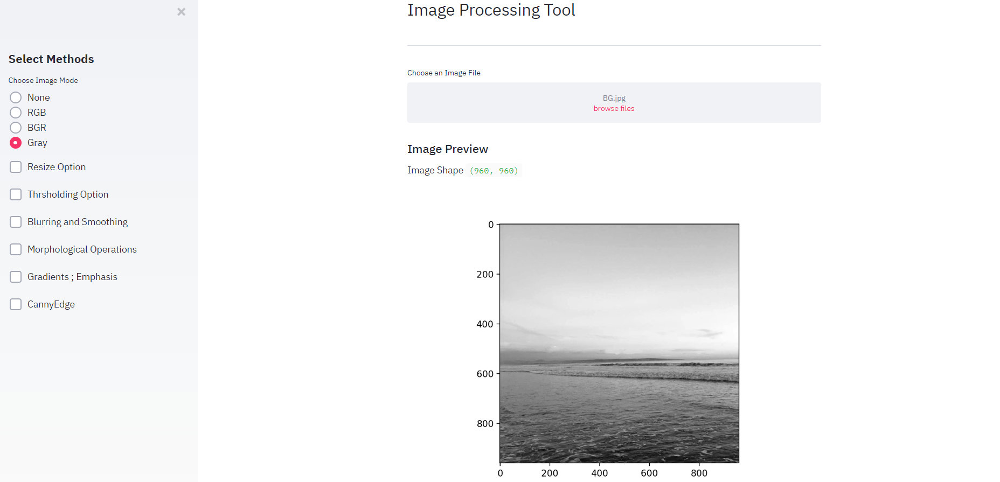

# General Image Processing App
General Overview of the Iris App


# Installation

This repository is tested on Python 3.6+

Clone the repository


```sh
$ git clone https://github.com/CJtheSloth/ImgProcessing
```

Install the dependencies

```sh
$ pip install pandas streamlit matplotlib,opencv-python
```

Run the application on `http://localhost:8501/`

```sh
$ streamlit run Image_Processing.py
```
